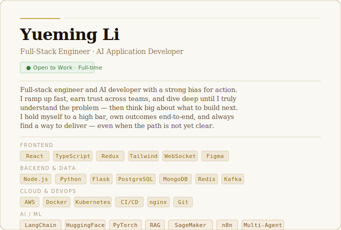

<!-- Profile banner — upload github_banner.svg to this repo root -->

---

## Selected Projects

**[🧠 MindClassify — Mental Health NLP Platform](https://github.com/YOUR_GITHUB_USERNAME/mindclassify)**
5-service system (React 18 + TailwindCSS, Node.js/Express, Flask inference, Gradio, MongoDB) orchestrated with Docker Compose + nginx. Fine-tuned MentalBERT on 50K posts — Macro F1 = 0.824, Suicidal Recall = 0.839.
`PyTorch` `HuggingFace` `BERT` `Flask` `React` `Docker`

**[🤖 Retail Trend Intelligence Agent](https://github.com/YOUR_GITHUB_USERNAME/retail-agent)**
Multi-agent AI orchestration system for trend discovery, competitor monitoring, and marketing content generation. Engineered prompt-chaining workflows with n8n and custom JS nodes.
`Gemini API` `Mistral API` `n8n` `Multi-Agent`

**[💊 Pharmaceutical Document AI — Pfizer Externship](https://github.com/YOUR_GITHUB_USERNAME/pharma-rag)**
RAG pipeline for pharmaceutical document Q&A — layout-aware OCR, document classification, blob routing for heterogeneous doc types. Gradio chatbot with full RAG integration.
`RAG` `LangChain` `OCR` `Gradio` `Python`

**[🛡️ Waterberry — Hackathon Emerald Honor Winner](https://github.com/YOUR_GITHUB_USERNAME/waterberry)**
Covert domestic violence aid platform disguised as an e-commerce site. Hidden risk-assessment questionnaire, one-click emergency alert, and resource library disguised as recipes.
`React` `Node.js` `Express` `MongoDB`

---

## GitHub Stats

---

## Let's Talk

I'm actively interviewing and happy to connect — whether it's a role, a referral, or just a conversation about something interesting you're building.

📬 **[lyueming1006@gmail.com](mailto:lyueming1006@gmail.com)** · 💼 **[linkedin.com/in/yuemingli](https://www.linkedin.com/in/yuemingli-b51573189/)** · 🌐 **[PORTFOLIO](https://yuemingli.contact/)**

*I read every message and usually reply within 24 hours.*

---

*Last updated: 2025 · still building, always learning.*

